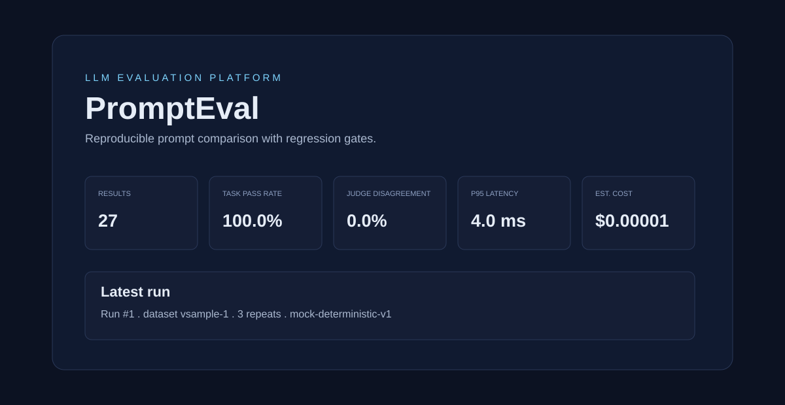
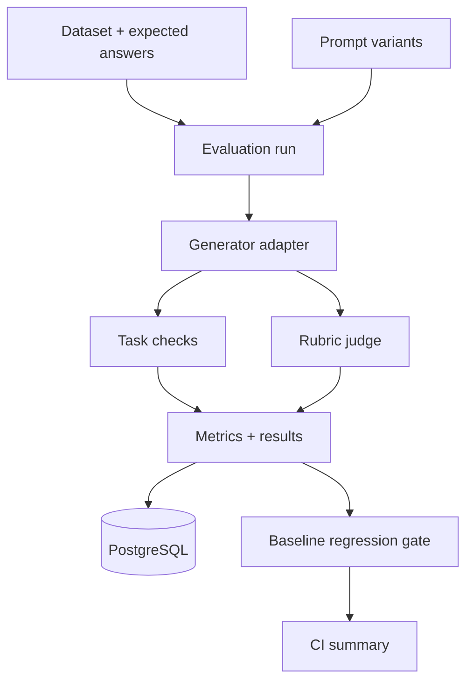

# PromptEval

**PromptEval is a reproducible LLM evaluation service for comparing prompt variants against a held-out dataset.** It combines deterministic task-specific checks with a rubric-based judge, persists complete run lineage, and produces CI-friendly regression reports with quality, disagreement, latency, and cost signals.

> Portfolio note: this repository implements the platform and its evaluation protocol. The 200-example / three-prompt / three-repeat numbers are a **configurable protocol target**, not a claimed completed benchmark result. The included sample data is deliberately small so anyone can run it locally in seconds.



## Why PromptEval

Prompt changes are production changes. A response may sound convincing while failing an exact output constraint, ignoring a safety rule, or quietly regressing on a case that previously passed. PromptEval makes those risks visible before a prompt is promoted.

The service answers four questions for every run:

1. **Did it satisfy deterministic requirements?** Task checks evaluate exact matches, required terms, and forbidden terms.
2. **Did a rubric judge consider it acceptable?** The judge records a score, pass/fail decision, and rationale.
3. **Do the checks and judge agree?** Disagreement is a first-class metric, not a hidden edge case.
4. **What changed operationally?** Each result records latency, token usage, and estimated cost; baselines expose regressions.

## What is implemented

| Capability | Implementation |
| --- | --- |
| API service | FastAPI with typed Pydantic request/response models and automatic OpenAPI docs |
| Persistence | SQLAlchemy data model for datasets, examples, prompt variants, runs, results, and baselines; PostgreSQL in Docker Compose |
| Reproducibility | A run snapshots dataset/version, prompt template, evaluator version, model configuration, random seed, and timestamp |
| Evaluation | Exact-match, contains-all, and contains-none task checks plus a pluggable rubric judge |
| Local judge | Deterministic heuristic judge for offline demos and CI; swap in an OpenAI-compatible endpoint through an adapter |
| Metrics | Pass rate, average judge score, judge/task disagreement, p50/p95 latency, and estimated cost |
| Regression gate | Baseline comparison flags pass-rate drops and disagreement increases above configured thresholds |
| CI | GitHub Actions runs unit tests, seeds a database, executes a smoke evaluation, and writes a Markdown summary |
| Demo UI | Read-only dashboard at `/` plus REST docs at `/docs` |

## Architecture



## Quick start

### Docker (recommended)

```bash
git clone https://github.com/sravani150602/prompteval.git
cd prompteval
cp .env.example .env
docker compose up --build
```

Open [http://localhost:8000](http://localhost:8000) for the dashboard and [http://localhost:8000/docs](http://localhost:8000/docs) for interactive API documentation.

In a second terminal, seed the sample dataset and execute a run:

```bash
docker compose exec api python -m app.seed
curl -X POST http://localhost:8000/runs \
  -H 'content-type: application/json' \
  -d '{"dataset_id": 1, "prompt_variant_ids": [1, 2, 3], "repeats": 3, "seed": 42}'
```

### Local development

```bash
python -m venv .venv
source .venv/bin/activate  # Windows: .venv\\Scripts\\activate
pip install -e '.[dev]'
export DATABASE_URL='sqlite:///./prompteval.db'
uvicorn app.main:app --reload
```

The test suite uses SQLite automatically; production Compose uses PostgreSQL 16.

## A complete API walkthrough

### 1. Create a held-out dataset

```bash
curl -X POST http://localhost:8000/datasets \
  -H 'content-type: application/json' \
  -d '{
    "name": "support-intent-heldout",
    "version": "2026.1",
    "description": "Frozen validation split",
    "examples": [
      {
        "input_text": "I was charged twice for my order",
        "reference_answer": "billing",
        "checks": {"exact_match": "billing"}
      }
    ]
  }'
```

Treat this data as evaluation-only: do not tune prompts against the same set. The dataset version and every example's checks are persisted with the run results.

### 2. Register prompt variants

```bash
curl -X POST http://localhost:8000/prompt-variants \
  -H 'content-type: application/json' \
  -d '{"name":"concise-v1","template":"Classify the request using one label: {input}"}'
```

Create `concise-v2` and `structured-v3` to compare the three-variant protocol.

### 3. Execute an evaluation run

```bash
curl -X POST http://localhost:8000/runs \
  -H 'content-type: application/json' \
  -d '{"dataset_id": 1, "prompt_variant_ids": [1,2,3], "repeats": 3, "seed": 42}'
```

For every `(example x prompt variant x repeat)` combination, the service renders the prompt, calls the configured generator, executes the task checks, evaluates the rubric judge, and stores a single immutable result record.

### 4. Inspect metrics and regressions

```bash
curl http://localhost:8000/runs/1
curl -X POST http://localhost:8000/baselines \
  -H 'content-type: application/json' \
  -d '{"name":"main","run_id":1}'
curl http://localhost:8000/runs/2/regression?baseline_name=main
```

The regression endpoint returns a pass-rate delta, disagreement-rate delta, and a `passed` gate. Defaults are intentionally conservative: a pass-rate drop over 2 percentage points or disagreement increase over 3 points fails the gate.

## Evaluation protocol

The project ships a small sample fixture. For a portfolio-scale validation, use this concrete protocol:

| Dimension | Target |
| --- | --- |
| Held-out examples | 200 |
| Prompt variants | 3 |
| Repeats per variant | 3 |
| Total generated outputs | 1,800 |
| Independent manual reviews | 30 outputs |
| Seeded regression cases | 10 |

Before reporting results, record the dataset source, redaction policy, split method, model/provider and version, judge rubric, random seed, and cost assumptions. Export per-result records before aggregating; averages alone conceal unstable failures.

### Judge disagreement

`judge_disagreement_rate` is the share of results where the binary task-check outcome and judge pass/fail outcome differ. It is not automatically an error: disagreement is a triage queue. Review those outputs first, then refine either the rubric or the task checks with an explicit rationale.

### Cost accounting

The demo generator estimates input and output tokens using a transparent whitespace approximation and applies configurable per-million-token rates. Replace `MockGenerator` with a provider adapter that returns provider token usage for production-grade accounting.

## Configuration

| Variable | Default | Purpose |
| --- | --- | --- |
| `DATABASE_URL` | `postgresql+psycopg://prompteval:prompteval@db:5432/prompteval` | SQLAlchemy database URL |
| `EVALUATOR_VERSION` | `1.0.0` | Recorded in run lineage |
| `INPUT_COST_PER_MILLION` | `0.15` | Demo cost model input rate (USD) |
| `OUTPUT_COST_PER_MILLION` | `0.60` | Demo cost model output rate (USD) |
| `PASS_RATE_DROP_THRESHOLD` | `0.02` | Maximum allowed baseline pass-rate decrease |
| `DISAGREEMENT_INCREASE_THRESHOLD` | `0.03` | Maximum allowed disagreement increase |

Never commit API keys. `.env.example` intentionally contains only non-sensitive local configuration.

## Project layout

```text
app/
  api.py            REST routes and dashboard
  engine.py         evaluation orchestration and metrics
  models.py         persisted lineage and result records
  adapters.py       generator and rubric-judge interfaces
  schemas.py        API contracts
  seed.py           reproducible sample fixture
tests/              unit, API, and regression tests
.github/workflows/  CI verification and Markdown report
docs/images/        README screenshots
```

## Testing and CI

```bash
pytest -q
ruff check .
```

The CI workflow runs these checks on every push and pull request. It also invokes `scripts/ci_smoke.py`, which creates a temporary SQLite database, seeds the deterministic fixture, runs the full evaluator, and writes a job summary with its metrics. A real deployment should additionally run against a managed PostgreSQL test database and a recorded provider fixture to avoid flaky network calls.

## Screenshot tour

The dashboard is intentionally simple so evaluators can inspect the platform without a frontend build step.


## Limitations and next steps

- The included generator and rubric judge are deterministic demo adapters; they do not claim model quality. Add an authenticated provider adapter only through environment variables and retain raw provider metadata.
- Rubric judging can itself be biased or inconsistent. Calibrate it against independently reviewed outputs and report agreement rather than treating it as ground truth.
- The service runs synchronously for clarity. For larger runs, enqueue work with Celery/Redis or a managed queue, add cancellation, and stream status updates.
- The current dashboard is read-only. Add authentication, RBAC, dataset access controls, encrypted retention, and audit logs before handling sensitive evaluation data.

## Resume-safe description

After you run the published protocol and record real results, a truthful bullet can look like:

> Built a FastAPI/PostgreSQL LLM evaluation platform that compares prompt variants with task checks and rubric-based judging; persisted reproducible run lineage and CI regression reports for pass rate, disagreement, latency, and cost.

Do **not** add the 200-example or 30-review counts to a resume until you have actually completed and can reproduce those runs.

## License

MIT. See [LICENSE](LICENSE).
